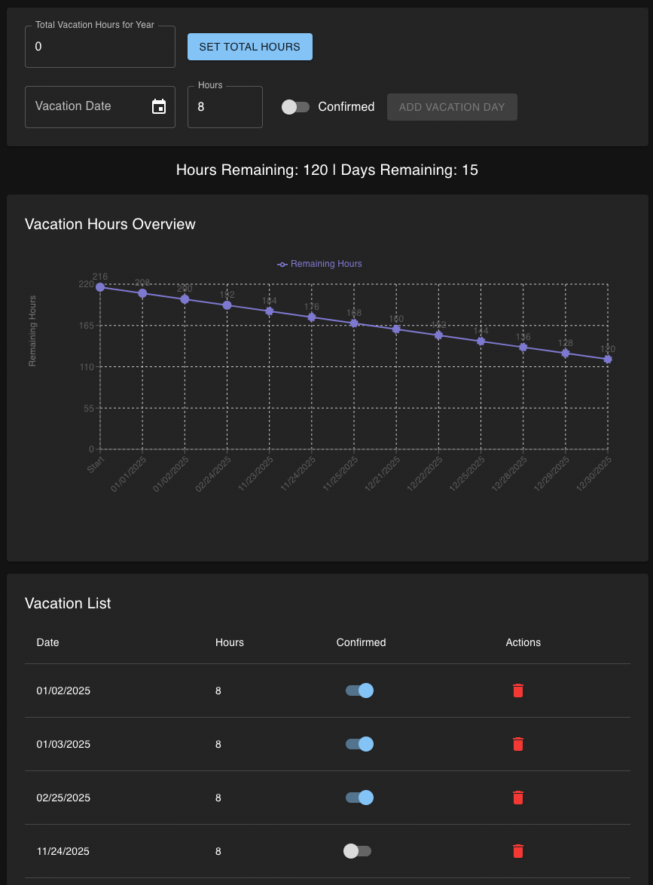
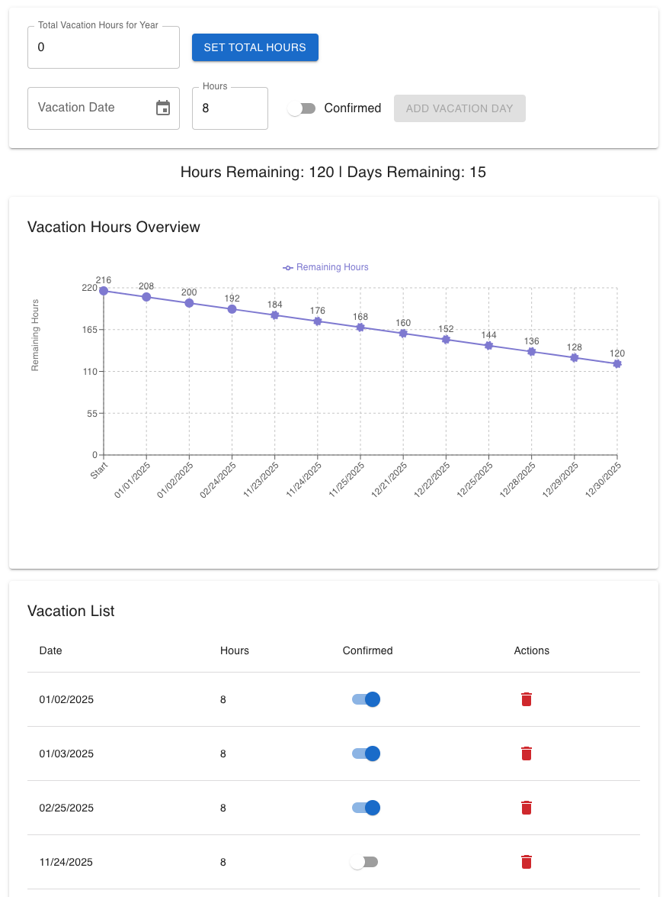

# Vacation Tracker

Track and plan your vacation time over the year. Built using React and FastAPI with postgresdb for storage.

## Features

- Track and forecast vacation time through the year
- Can toggle between confirmed and not confirmed to forecast (more functionality coming on that)
- Toggle between dark and light modes
- Everything stored in a local postgresdb instance (included in the docker-compose.yml)

## Installation

### Build Image Locally

1. Clone the repository:
   ```sh
   git clone https://github.com/abrazier/vacation-tracker.git
   ```
1. Build the docker image:
   ```
   docker compose up -d --build
   ```
   Access the app at IP:3000.

## Screenshots

### Screenshot 1



### Screenshot 2


